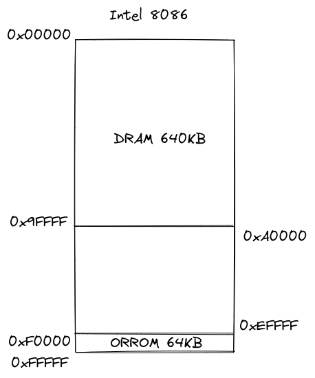
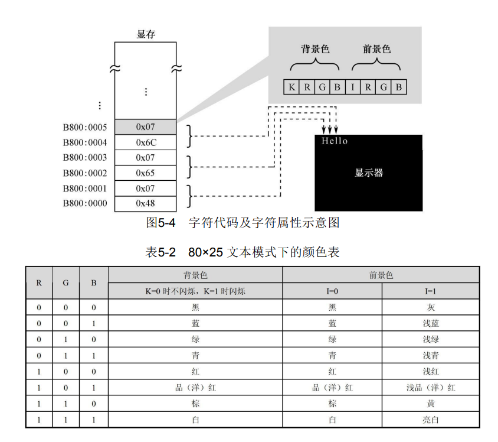
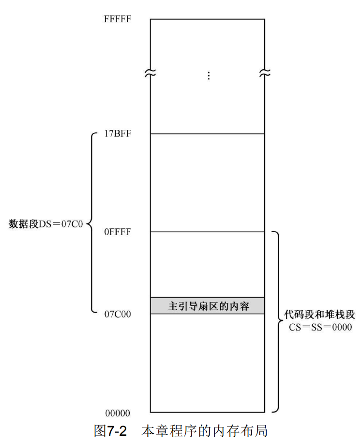
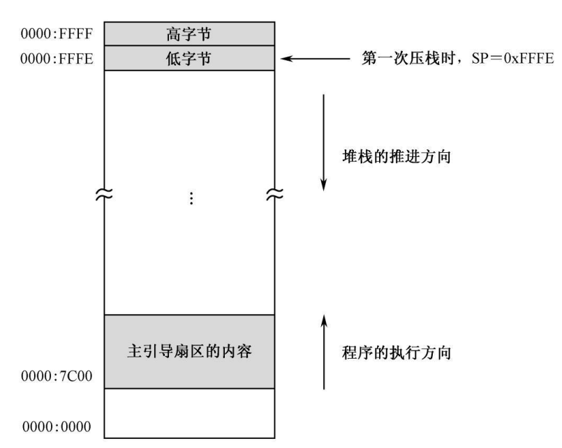

[toc]

# 基础知识

## 通用寄存器的各个作用

- **AX** 是累加器（Accumulator）寄存器：与它有关的指令还会做指令长度上的 优化（较短）。
- **CX** 是计数器（Counter）寄存器：用来loop指令记数。
- **DX** 是数据（Data）寄存 器：除了作为通用寄存器使用外，还专门用于和外设之间进行数据传送。
- **SI** 是源索引寄存器（Source Index）：搭配BX或BP来使用，充当源地址的索引。
- **DI** 是目标索引寄存器 （Destination Index）：搭配BX或BP来使用，充当目的地址的索引。
- **BX** 是基址寄存器（Base Address Register）：用来提供数据访问的基 地址。

## 大端和小端序列

计算机在存储数据时候按照数据高地位存放在地址顺序不同分为**大端序列**和**小端序列**。

大端序列：把数据的高位存放在高地址，低位存放在低地址。

小端序列：把数据的高位存放底地址，低位存放在高地址。

如果是超过一个字节的立即数操作，小段模式就是地址由低到高，从后往前存储数据，比如存储0x1234，要写成0x3412。

存放一个数据0x1234，大端和小端的区别：

| 地址  | 大端 | 小端 |
| ----- | ---- | ---- |
| 0x001 | 0x34 | 0x12 |
| 0x002 | 0x12 | 0x34 |

> 计算机是执行方向是从底地址向高地址

# 分段机制

为什么要引入分段机制？

1. 能够让数据和代码分开，分成数据段和代码段。

2. 有助于解决重定位问题。

首先解释一下第一条，为什么数据和代码要分开放在不同的内存里，因为指令一旦掺杂了其他不是指令的数据时，CPU就无法正确地识别指令，无法继续运行下去。分开是为了防止数据和指令混淆。

第二条重定位问题，我们不可能一直用绝对物理地址，我们知道计算机在运行的时候是多程序运行的，编写代码时候指定的绝对物理地址，可能已经被其他正在运行的程序占用了。**这时候我们用定义一个段，程序运行都限定在这个段里，什么跳转指令，将数据载入特定内存指令，凡是需要用到地址的，都用相对这个段的偏移地址，其真正地址是：段+偏移量**。将来载入内存时候，操作系统负责分配空闲的段，这样程序可以愉快的在内存中玩耍啦！

## 分段机制的实现

分段机制早在16位处理器时代已经开始支持 -- 特意搞了个段寄存器。下面介绍一些8086处理器的段处理器。

- CS(Code Segment)配合IP进行代码分段
- DC(Date Segment)配合通用寄存器进行数据分段
- ES(Exta Segment)配合通用寄存器进行灵活分段

分段寄存器负责定位段地址，IP或通用处理器负责定位相对段的偏移地址。

这个ES段寄存器也有大用处，最典型的就是，当需要从一个地址的数据复制到另外一个地址上时，用DC指定源地址，ES指定目的地址。

> 还有一个SS(Stack Segment)段寄存器没有介绍，这个用来保存栈段，栈还重要，基本功能就是用来传递函数的阐述，操作系统切换进程时，用来保存上下文（进程的运行环境）......栈是C语言的运行环境，没有栈就没有C语言。

# 8086开机流程

## 8086内存全景图



> 0xA0000~0xEFFFF 用来映射外围设备寄存器

## 首当其冲的BIOS

BIOS(Base Input & Output System)全称为基本输入输出系统，8086 加电或者复位时，硬件会强制设置`CS=0xFFFF;IP=0x0000`，所以，它取的第一 条指令位于物理地址0xFFFF0，正好位于ROM 中，那里固化了开机时需 要执行的指令。所以，ROM 中位于物理地址0xFFFF0 的地方，通常是一个跳转指 令，它通过改变CS 和IP的内容，使处理器从ROM 中的较低地址处开始 取指令执行。在NASM 汇编语言里，一个典型的跳转指令像这样：

```nasm
jmp 0xF000:0xE05B
```

ROM-BIOS 的容量是有限的，当它完成自己的使命后，最后所要做 的，就是从硬盘读取指令数据，然后转到那里开始执行。基本 上，这相当于接力赛中的交接棒。

## 接下接力棒的硬盘主引导扇区

BIOS完成基本的初始化后，会把硬盘里的程序载入到`0x7c00`这个地址执行，这个已经是一种惯例，就像现在学习所有新的编程语言时候，都会写一个`hello world!`例程。所以BIOS最后的指令一定是：

```nasm
jmp 0x0000:0x7c00
```

硬盘里的存储空间是不连续的，一般都是以一个扇区一个扇区分开，而一个扇区大小一般为512KB，我们把硬盘的第一个扇区称为**主引导扇区**——顾名思义，这个扇区的作用就是用来引导程序进入内存的。

BIOS是要验证硬盘的主引导扇区是否合法的，不合法就不能载入内存，大概是为了防止硬盘损坏了。而合法标志很简单，就是主引导扇区最后两个字节为`0x55` 和`0xAA`，我们成为这个叫魔数。

> 一般来说，主引导扇区是由操作系统负责的。正常情况下，一段精
> 心编写的主引导扇区代码将检测用来启动计算机的操作系统，并计算出
> 它所在的硬盘位置。然后，它把操作系统的自举代码加载到内存，也用
> jmp 指令跳转到那里继续执行，直到操作系统完全启动。

后面的事情就看主引导扇区程序怎么写了，比如可以从硬盘加载更多程序段，相当于一个跳板，自举程序。

# 显示字符

一般来说，用于存放显示数据的物理地址位于`0xB8000~0xBFFFF`，这段地址专门留给显卡的，我们在此处存储一些数据，比如ACII码，这些码转换成对应的文字就能显示在屏幕上，显示的细节由显卡完成。


我们只要往这个地址写入一些ACII码，屏幕就能显示出相应的文字

## 打印字符程序

两个字节表示屏幕上的一个字符，第一个字符为ACII码，第二个控制着字符的前景色和背景色，前景色就是字体的颜色，背景色即顾名思义。



一个显示`hello`的汇编程序实现：

```nasm
mov ax, 0xb800;0xb8
mov ds, ax

mov byte [0], 'H'
mov byte [1], 0x07;背景为黑色，字体为白色且不闪烁
mov byte [2], 'e'
mov byte [3], 0x07
mov byte [4], 'l'
mov byte [5], 0x07
mov byte [6], 'l'
mov byte [7], 0x07
mov byte [8], 'o'
mov byte [9], 0x07

halt:
        jmp halt

times 510 - ($ - $$) db 0 ;用0填充剩下的内存
db 0x55, 0xaa;魔数，也可以这样写`dw 0xaa55`，英特尔是小端模式，按字存储立即数的话，从低地址到高地址从立即数的后往前存
```

> `mov byte [0], 'H'` = `mov byte [ds:0x00], 'H'` ，不指定段寄存器就默认使用byte。

下面解释一下这段程序：

1. **初始化段寄存器**。不能直接使用立即数，而是地址单元或寄存器
2. **默认使用DS寄存器**。`mov byte [0], 'H'` = `mov byte [ds:0x00], 'H'` ，不指定段寄存器就默认使用DS寄存器。
3. **地址单元**。地址单元用中括号围着，像`[0]`
4. **mov指令的格式**。mov 目的操作数 源操作数。目的操作数的作 用应该相当于一个“容器”，故必须是通用寄存器或者内存单元；源操作数呢，也可以是和目的操作数具有相同数据宽度的通用寄存器和内存单 元，还可以是立即数。传送指令只影响目的操作数的内容，不改变源操 作数的内容。
5. **byte**。如果源操作数是立即数，那么必须显式地指明是byte操作还是word操作。如果是寄存器就不用，因为寄存器的位数已经决定了是byte操作或word操作，比如AX一定是word操作，AH或AL一定是byte操作。
5. **jmp指令**。jmp指令有两种形式，一种给出绝对地址，如：`jmp [0x2000:0x0004]`；一种是给出标号地址（汇编地址），如：`jmp halt`，它最终的转移地址是这样计算的：**标号处汇编地址 - 当前指令汇编地址 - 当前指令长度 + PC寄存器存储的地址 + 当前指令长度**。这里的halt标号就是当前指令地址，所以为0，减去一回当前指令长度，加上一回当前指令长度，而PC寄存器就是当前指令地址，所以进入无限循环。
5. **tiems指令**。`times 次数 指令`，执行`次数`次`指令`，而这里的`$`就是当前指令汇编地址，`$$`就是程序开始的汇编地址，`($ -$$)`就是计算程序到此为此的长度。为什么要减去510字节，因为最后的魔数占用了2个字节。这样就能保证主引导扇区的最后两个字节为`0x55`和`0xaa`。

## 打印编号处汇编地址程序

一个`number_print.asm`的程序实现：

```nasm
org 0x7c0

mov ax, 1234
mov dx, 0
mov bx, 10
mov cx, number;如果没有`org 0x7c0`，这里就要加上偏移量0x7c0
mov ds, cx

;个位
div bx
mov [0], dx
xor dx, dx

;十位
div bx
mov [1], dx
xor dx, dx

;百位
div bx
mov [2], dx
xor dx, dx

;千位
div bx
mov [3], dx
xor dx, dx

mov al, [0]
add al, 0x30
mov [0], al

mov al, [1]
add al, 0x30
mov [1], al

mov al, [2]
add al, 0x30
mov [2], al

mov al, [3]
add al, 0x30
mov [3], al

mov ax, 0xb800
mov es, ax
mov bx, 0x07

mov ax, [3]
mov [es:0], ax
mov [es:1], bx

mov ax, [2]
mov [es:2], ax
mov [es:3], bx

mov ax, [1]
mov [es:4], ax
mov [es:5], bx

mov ax, [0]
mov [es:6], ax
mov [es:7], bx

halt:
        jmp halt

number db 0x00, 0x00, 0x00, 0x00

times 510 - ($ - $$) db 0
db 0x55, 0xaa
```

1. **div除法指令**。如果被除数是16位，除数是8位，则被除数必须在寄存器AX中，除数可以是8位的通用寄存器或者内存单元提供；**如果被除数是32位，除数是16位，则被除数的高16位在DX中，低16位在AX中**，除数可以是16位的通用寄存器和内存单元提供。
2. **add加法指令**。左边是被加数，右边是加数，左边可以是寄存器或内存单元，右边也可以是寄存器或内存单元，但是两边不能同时是内存单元。加法结果保存在左边。
3. **org指令**。指定标号的偏移量，如此一来所有汇编地址都会加上这个偏移量，因此以后在访问数据的时候不用特意加上这个偏移量这么麻烦。
3. **xor指令**。异或运算，同为0，异为1。

## 打印标号处汇编地址程序改良版

```nasm
org 0x7c00

jmp start

variable: 
        number: db 0, 0, 0, 0
start:
        ;设置ds
        mov ax, number
        mov ds, ax
        ;设置被除数
        mov ax, 1111
        xor dx, dx
        mov si, 10
	mov di, 0
	mov cx, 4

gain_digit:
        div si
        mov [di], dl
	inc di
        xor dx, dx
	loop gain_digit

	xor si, si
	xor di, di
        mov ax, 0xb800
        mov es, ax
	mov si, 3
	mov di, 0
show:
	mov ah, 0x40
	mov byte al, [si]
	add al, 0x30
	mov [es:di], ax
	add di, 2
	dec si
	jns show
	
halt:
        jmp halt

times 510 - ($ - $$) db 0
db 0x55, 0xaa
```

1. **movsb和mvsw指令**。这两个指令通常用于将数据从内存中一个地方批量地传送到另一个地方。**源数据的段地址由DS指定，偏移地址由SI指定，简称DS:SI**。**目的数据的段地址由ES指定，偏移地址由DI指定，简称ES:DI**。也分正方向和负方向，正方向就是由低地址向高地址，负方向相反，通过指定FLAGS的第10位方向标志DF指定，置0为正方向，置1为负方向。一般通过`cld`将方向标志位置0，通过`std`设置方向标志位置1，这两个指令都没有操作数，只有操作码。
2. **FLAGS寄存器**。此寄存器的ZF位很重要，如果上一次计算结果为0，这一位会被置为1，否则置0。如果运算结果的最高位是“1”，它将SF标志置“1”，否则置“0”。
3. **loop循环指令**。指令格式为`loop 标号或地址`，一般为标号，CX寄存器存放循环次数，每循环一次就减1，如果CX如果为0不跳转loop指令的标号处，否则跳转loop指令的标号处。
4. **neg指令**。反转一个立即数，如果立即数是一个有符号数，此指令就将其转换成无符号数，如果是无符号数则相反。
5. **cbw/cbd指令**。这个用来为有符号数作扩展用的，为什么特定于有符号数呢，因为无符号数扩展只需要将高位清零，而有符号数要置1，还是比较麻烦的。cwb只有一个操作码，一旦执行了，它将寄存器AL中的有符号数扩展到整个AX寄存器，也就是字节->字；cbd执行了，它将寄存器AX的有符号数的高16位扩展到寄存器DX，此时DX中应该全是1。
6. **int和dec指令**。int是自加1，dec是自减1。
7. **jns指令**。如果FLAGS寄存器的SF位为0，则执行到标号处。jns 是条件转移指令，处理器在执行它的时候要参考标志寄存器的SF 位。除了只是在符合条件的时候才转移之外，它和jmp 指令很相似，它也是相对转移指令，编译后的机器指令操作数也是一个相对偏移量，是 用标号处的汇编地址减去当前指令的汇编地址，再减去当前指令的长度 得到的。

### 溢出和有符号的除法指令

加法指令是不区分有符号和无符号的，立即数只需要前面加一个负号，一样能正确计算，所以加法指令可以当减法指令，当然指令集也特地提供了一个减法指令`sub`

```nasm
mov al, 1
add al, -1;结果为0

mov ah, 1
neg ah
add al, ah;结果为0

mov al, 1
sub al, 1;等价于上面两段代码
```

而除法指令就不一样了，具体看下面代码:

```nasm
mov ax, 0x0400
mov bl, 0xf0
div bl
```

从无符号数的角度来看，0x0400 等于十进制数1024，0xf0 等于十 进制数240。相除后，寄存器AL 中的商为0x04，即十进制数4，完全正 确。 

但是，从有符号数的角度来看，0x0400 等于十进制数1024，0xf0 等于十进制数－16。理论上，相除后，寄存器AL 中结果应当是0xc0。因 其最高位是“1”，故为负数，即十进制数为－64。 为了解决这个问题，处理器专门提供了一个有符号数除法指令 idiv

所以正确的代码如下：

```nasm
mov ax, 0xf0c0
mov bl, 0x10
idiv bl
```

以上的代码是16 位二进制数除法，结果在寄存器AL 中。除法的结 果应当是十进制数－244，遗憾的是，这样的结果超出了寄存器AL 所能表示的范围，必然因为溢出而不正确。为此，你可能会用32 位的除法来 代替以前的做法：

```nasm
xor dx, dx
mov ax, 0xf0c0
mov bx, 0x10
idiv bl
```

很遗憾，这依然是错的。十进制数－3904 的16 位二进制形式和32 位二进制形式是不同的。前者是0xf0c0，后者是0xfffff0c0。还记得cwd 吗？你应该用这条指令把寄存器AX 中数的符号扩展到DX。所以，完全 正确的写法是这样的：

```nasm
mov ax, 0xf0c0
cwd
mov bx, 0x10
idiv bx
```

以上指令全部执行后，寄存器AX 中的内容为0xff0c，即十进制数－ 244。

主动权在你自己手上，在写程序的时候，你要做什么，什么目的， 你自己最清楚。如果是无符号数计算，必须使用div 指令；如果你是在做 有符号数计算，就应当使用idiv 指令。

### 变址寄存器

注意，INTEL8086 处理器只允许以下几种基址寄存器和变址寄存器 的组合：

```nasm
[bx+si]
[bx+di]
[bp+si]
[bp+di]
```

这些组合可以用于任何带有内存操作数的指令中。其他任何组合， 比如[bx+ax]、[cx+dx]、[ax+cx]等等，都是非法的。

## 各种标志位

- 奇偶标志位PF
  计算结果的低八位中的1的数量为偶数这一位就置1，1的数量为0也会置1，否则置0
- 进位标志位CF
  无符号数溢出就置1，否则置0
- 溢出标志位OF
  有符号数溢出就置1，否则置0
- 方向标志位DF
  这一位为0就是正方向，为1就是反方向，用cld置0，用std置1
- 负数标志位SF
  最高位为1则为1，为0则为0
- 零数标志位ZF
  运算结果为0则为1，不为0则为0
- 辅助标识位AF
  在进行算术运算的时候，如果低字节中低4位产生进位或者借位的时候，则置1，否则置0

目前已知的指令对标志位的影响，如下表：

| 指令                | 对标志位的影响                                               |
| ------------------- | ------------------------------------------------------------ |
| 加法指令add         | OF/SF/ZF/AF/CF和PF的状态依计算结果而定。                     |
| 扩展指令cdw/cwd     | 不影响任何标志位。                                           |
| 置位指令cld/std     | DF=0, 其他标志位未定义。未定义的意思是到目前为之还不打算让该指令影响到这些标志位，因此，不要在程序中以来这些标志。 |
| 自减自增指令dec/inc | CF标志不受影响，因为该指令通常在程序中用于循环记数，而且在循环体内通常有以来CF标志的指令，故不希望它打扰CF标志。对OF/SF/ZF/AF/CF和PF的状态依计算结果而定。 |
| 除法指令div/idiv    | 对OF/SF/ZF/AF/CF和PF的影响未定义。                           |
| 转移指令mov/movs    | 不影响任何标志位。                                           |
| 减法指令sub         | OF/SF/ZF/AF/CF和PF的状态依计算结果而定。                     |
| 异或指令xor         | OF=0，CF=0；对SF/ZF和PF依计算结果而定；对AF的影响未定义。    |

## 条件跳转指令

简单的跳转指令：

| 指令   | 解释                                                  |
| ------ | ----------------------------------------------------- |
| js/jns | 第一：signed SF=1 第二：not signed SF!=1 也就是SF=0。 |
| jz/jnz | 同上，参考的是ZF标志位。                              |
| jo/jno | 参考的是OF标志位。                                    |
| jc/jnc | 参考的是CF标志位。                                    |
| jp/jnp | 参考的是PF标志位。                                    |
| jcxz   | jump if CX is zero                                    |

上面是一些将的跳转指令，因为它只看一个标志位，但有时候我们想完成更复杂的条件判断，比如：当AX 寄存器里的内容为0x30 的时候转移，或者当AX 寄存器里的内容小于0xf0的时候转移，再或者， 当AX 寄存器里的内容大于寄存器BX 里的内容时转移。

这时候要用到**cmp**指令了。

cmp 指令在功能上和sub 指令相同，唯一不同之处在于，cmp 指令 仅仅根据计算的结果设置相应的标志位，而不保留计算结果，因此也就 不会改变两个操作数的原有内容。cmp 指令将会影响到CF、OF、SF、 ZF、AF 和PF 标志位。

**比较是拿目的操作数和源操作数比，重点关心的是目的操作数**。拿 指令cmp ax,bx 来说，我们关心的是AX 中的内容是否等于BX 中的内 容，AX 中的内容是否大于BX 中的内容，AX 中的内容是否小于BX 中的内容，等等，AX 是被测量的对象，BX 是测量的基准。

比较的结果如表：

| 比较结果 | 英文描述          | 指令 | 相关标志位的状态                                             |
| -------- | ----------------- | ---- | ------------------------------------------------------------ |
| 等于     | Equal             | je   | 相减结果位0才成立，故要求ZF=1                                |
| 不等于   | Not Equal         | jne  | 相减结果不为零才成立，故要求ZF=0                             |
| 大于     | Greater           | jg   | 适用于有符号比较，要求：ZF=0（两个数不同，相减的结果不为零）（等于是不成立的），并且SF=OF（如果相减后溢出，则结果必须是负数，说明目的操作数大，一个较小的正数和一个较大的负数；如果相减后未溢出，则结果必须是正数，也表明目的操作数大些，负数和正数，正数和正数，负数和负数） |
| 大于等于 | Greater or Equial | jge  | 适用于有符号数的比较，要求：SF=OF（如果是相等，则ZF=1，也满足SF=OF） |
| 小于     | Less              | jl   | 适用与有符号数的比较，要求SF!=OF（两个数相同，则ZF=1，但是SF=OF=0，因此相同本身不满足SF!=OF） |
| 小于等于 | Less or Equal     | jle  | 适用于有符号数的比较，要求：ZF=1（两个数相同，相减的结果为零），或者SF!=OF（如果相减后溢出，则结果必须是正数，说明源操作数大，一个较小的负数和一个较小的正数或较大的负数；如果相减后溢出，则结果必须是负数，同样表明源操作数大些） |
| 高于     | Abov              | ja   | 适用于无符号数的比较，要求：CF=0（没有进位或错位）（等于是不成立的）而且ZF=0（两个数不相同） |
| 高于等于 | Abov or Equal     | jae  | 适用于无符号数的比较，要求：ZF=0（目的操作数大一些，不需要借位） |
| 低于     | Below             | jb   | 适用于无符号数的比较，要求：CF=1                             |
| 低于等于 | Not Below         | jbe  | 适用于无符号数的比较，要求：CF=1或者ZF=1                     |

有几点可以辅助记忆：

关于ZF的

- 对于有符号数：**ZF=1本身就满足了SF=OF**；ZF=0，可能满足两个条件：SF=OF或SF!=OF。
- 对于无符号数：**ZF=1本身就满足了CF=0**；ZF=0,可能满足两个条件：CF=0或CF=1。

关于大于小于的

- 对于有符号数：**大于必定要满足SF=OF；小于必定要满足SF!=OF**。
- 对于无符号数：**高于必定要满足CF=0；低于必定要满足CF=1**。

- **大于小于本身不包含等于**。

可以看到，有符号数`ZF=1`（两数`等于`）本身满足`SF=OF`（`大于`），而`大于`本身并不包含`等于`，所以大于要对于ZF标志位做一个限定，就是`ZF=0`。

无符号数`ZF=1`（两数`等于`）本身满足CF=0（`高于`），而`高于`本身并不包含`等于`，所以高于要对于ZF标志位做一个限定，就是`ZF=0`。

# 栈的引入

一步步实现从1累加到100，得到结果后，将结果各个数位分解后入栈，然后出栈到`0xB800`处。

### 显示数学表达式

此代码打印这样的数学表达式`1+2+3+...+100=`

```nasm
jmp near start

message db '1+2+3+...+100='

start:
        ;初始化ds和es
        mov ax, 0x07c0
        mov ds, ax

        mov ax, 0xb800
        mov es, ax

        ;初始化si和di以及cx
        mov si, message
        mov di, 0
        mov cx, start - message

message_print:
        mov al, [si]
        mov [es:di], al
        inc di
        mov byte [es:di], 0x07
        inc di
        inc si
        loop message_print

jmp near $

times 510 - ($ - $$) db 0
dw 0xaa55
```

使用了一种没有使用过的方式打印字符，字符直接写在数据区，字符间没有其他数据，关于打印字符的所有细节，全部封装在了message_print这么一个类似函数的标号处代码。

### 栈段/代码段/数据段的分布

实现一个使用栈来存储分解后的数位，然后把它推出来，分别写入显存位置，本程序的栈段/代码段/数据段分布：



首先设SS和SP为零，每做一次入栈操作，减2，也就是`0x0000 - 0x0002＝0xFFFE`



要注意**保持栈平衡**，如果在做某件事的时候要使用栈，那 么，栈指针寄存器SP 在做这件事之前的值，应当和这件事做完后的值相同。就是说，push 指令和pop 指令的数量应当是相同的。

如果使用不当，将会出现问题，下面就是一个例子：

```nasm
repeat:
	push ax
	......	;其他非栈操作的指令
	pop bx
	pop ax
	loop repeat
```

以上的循环是干什么用的，做什么事情，这个不重要。因为每次循 环时，都要用到寄存器AX 和BX 的原始内容，所以，循环体的开头要压 栈保存它们，在循环体的末尾要出栈恢复它们。但是你看到了，由于一 时疏忽，只压入了寄存器AX，而在出栈时，却多弹了一个数值到BX 中。在这种情况下，栈是不平衡的，程序的运行结果当然也不会正确。

**在编写程序前，必须充分估计所需要的栈空间，以防止破坏有用的数据**。

本程序栈段和代码段属于同一个内存段，段地址都是0x0000，段的长度都 是64KB。主引导程序的长度是512（0x200）字节，从偏移地址0x7c00 延伸到0x7e00。栈是向下增长的，它们之间有0xffff－0x7e00＋1＝ 0x8200 字节的空档。通常来说，我们的程序是安全的，因为不可能压入 这么多的数据。但是，不能掉以轻心，**栈定义得过小，而且程序编写不 当，导致栈破坏了有用数据的情况也时有发生**。

尽管不能完全阻止程序中的错误，但是，**通过将栈定义到一 个单独的64KB 段，可以使错误仅局限于栈，而不破坏其他段的有用数据**。假如栈的段地址是0x0000，大小是64KB，那么，无论SP 怎样变 化，压栈和出栈操作始终会在该段内进行，而不会影响到其他无关的内 存区域。这样，无论任何时候，即使是push 指令位于一个无限循环中， 栈指针寄存器SP 的内容也永远只会在0x0000～0xFFFF 之间来回滚动， 不会影响到其他内存段。

代码实现如下：

```nasm
jmp near start

message db '1+2+3+...+100='

start:
        ;初始化ds和es
        mov ax, 0x07c0
        mov ds, ax

        mov ax, 0xb800
        mov es, ax

        mov ax, 0
        mov ss, ax
        mov sp, ax

        ;初始化si和di以及cx
        mov si, message
        mov di, 0
        mov cx, start - message

printMessage:
        mov al, [si]
        mov [es:di], al
        inc di
        mov byte [es:di], 0x07
        inc di
        inc si
        loop printMessage

        xor ax, ax
        mov cx, 1
oneToHhunderd:
        add ax, cx
        inc cx
        cmp cx, 100
        jle oneToHhunderd

        mov bx, 10
        xor cx, cx
gainDigit:
        inc cx
        xor dx, dx
        div bx
        or dl, 0x30
        push dx
        cmp ax, 0
        jne gainDigit

        mov bx, (start - message) * 2
        mov si, 0
printNumber:
        pop dx
        mov [es:bx+si], dl
        inc si
        mov byte [es:bx+si], 0x07
        inc si
        loop printNumber

jmp near $

times 510 - ($ - $$) db 0
dw 0xaa55
```

- **or指令**。0|0=0；0|1=1；1|0=1；1|1=1。留1。
- **pop和push指令**。两个操作都是以字为单位。

### bochs调试

- s:单步调式，next instruction
- b:设置断点，只有一个地址参数
- n:跳出利用CX寄存器控制的循环
- u:反汇编，第一个参数加/再加一个数，这个数的意思是反汇编多少条指令，第二个参数是地址，如果不写那就说明当前位置开始反汇编。一般可以用于跳过根据标志位而跳转的循环体。
- info eflags: 获取flags寄存器的信息，其中大写表明值是1，小写说明值是0
- print-stack：它可以带一个参数，用于 指定显示多少数据。如果不使用参数，则默认显示当前栈中的16 个字。

## 访问硬盘和显卡

### 访问硬盘

访问硬盘采用端口号的形式，具体方式就是：通过寄存器向端口号写数据达到设置访问硬盘信息，通过寄存器读取特定端口号达到读取硬盘。

| 端口号              | 描述                                                         |
| ------------------- | ------------------------------------------------------------ |
| 0x1f2               | 用于设置要读取的扇区数量，这是 个8 位端口，因此每次最多能读写255 个扇区。注意，如果写入的值为0，则表示要读取256 个扇区。每读一个扇区，这个数值就减一。如果在读写过程中发生错误，该端口包含 着尚未读取的扇区数。 |
| 0x1f3、0x1f4、0x1f5 | 28 位的扇区号太长，需要将其分成4 段，分别写入端口0x1f3、0x1f4、0x1f5 和0x1f6 号端口。其中，0x1f3 号端口存放的是0～7 位；0x1f4 号端口存放的是8～15 位；0x1f5 号端口 存放的是16～23 位，最后4 位在0x1f6 号端口。 |
| 0x1f6               | 是一个8位端口，0x1f6 端口的低4 位用于存放逻辑扇区号的24～27位，第4 位用于 指示硬盘号，0 表示主盘，1 表示从盘。高3 位是“111”，表示LBA 模式。 |
| 0x1f7               | 向端口0x1f7 写入0x20，请求硬盘读。端口0x1f7 既是命令端口，又是状态端 口。在它内部操作期间，它将0x1f7 端口的第7位置“1”，表明自己很忙。 一旦硬盘系统准备就绪，它再将此位清零，说明自己已经忙完了，同时 将第3 位置“1”，意思是准备好了，请求主机发送或者接收数据。 |
| 0x1f0               | 0x1f0 是硬盘接口的数据端口，而且还是一 个16 位端口。一旦硬盘控制器空闲，且准备就绪，就可以连续从这个端 口写入或者读取数据。 |

#### 专门用来访问端口的指令

有两个：`in`和`out`。in 指令是从端口读，in 指令的目的操作数（左边）必须是寄存器AL 或者AX，当访问8 位的端口时，使用寄存器AL；访问16 位的端口时，使用AX。

```nasm
in al, dx
in ax, dx
```

以上其中，dx中存储端口号。也许是为了方便，in 指令还有两字节的形式。此时，前一字节是操 作码0xE4 或者0xE5，分别用于指示8 位或者16 位端口访问；后一字节是立即数，指示端口号。

```nasm
in al, 0xfo
in ax, 0x03
```

很显然，因为这种指令形式的操作数部分只允许一字节，故只能访 问0～255（0x00～0xff）号端口，不允许访问大于255 的端口号。所 以，下面的汇编语言指令就是非法的：

```nasm
in ax, 0x5fd
```

out 指令正好和in 指令相反，往端口写入数据，目的操作数可以是8 位立即数或者寄存 器DX，源操作数必须是寄存器AL 或者AX。下面是一些例子：

```nasm
out 0x37, al	;写0x37端口，这是一个8位端口
out 0xf5, ax	;写0xf5端口，这是一个16位端口
out dx, al		;这是一个8位端口，端口号存储在dx中
out dx, ax		;这是一个16位端口，端口号存储在dx中
```

#### 子函数调用

有两个指令要理解，一个是调用指令`call`或`call far`，根据调用位置它的格式有些许复杂，一个是返回指令`ret`或`rotf`。

`call`指令有四种格式：

1. **16 位相对近调用**。该操作数是当前call 指令相对于目标过程的偏移 量。计算过程如下：用目标过程的汇编地址减去当前call 指令的汇编地 址，再减去当前call 指令以字节为单位的长度（3），保留16 位的结果。换句话说，被调用过 程的首地址必须位于距离当前call 指令－32768～32767 字节的地方。它用指令指针寄存器IP 的当前内容加上指令中的操作数， 再加上3，得到一个新的偏移地址。接着，将IP 的原有内容压入栈。最 后，用刚才计算出的偏移地址取代IP 原有的内容。这直接导致处理器的 执行流转移到目标位置处。

    ```nasm
    call .lable		;直接使用标号来调用，省略了关键字"near"
    ```

2. **16 位间接绝对近调用**。这种调用也是近调用，只能调用 当前代码段内的过程，指令中的操作数不是偏移量，而是被调用过程的 真实偏移地址，故称为绝对地址。不过，这个偏移地址不是直接出现在 指令中，而是由16 位的通用寄存器或者16 位的内存单元间接给出。在指令执行的时候由处理器从该寄存器取得，并直接取代指 令指针寄存器IP 原有的内容。剩下的过程跟相对近调用是一样的。

    ```nasm
    call cx				;目标地址在cx中。省略了关键字"near",下同
    call [0x3000]		;要向访问内存才能取得目标偏移地址
    call [bx]			;要先访问内存才能取得目标偏移地址
    call [bx+si+0x02]	;要先访问内存才能取得目标偏移地址
    ```

3. **16 位直接绝对远调用**。这种调用属于段间调用，即调用 另一个代码段内的过程，所以称为远调用（far call）。远调用既需要被调用过程所在的段地址，也需要该过程在段内的偏移地 址。“直接”的意思是，段地址和偏移地址直接 在call 指令 中给出了。当然，这里的地址也是绝对地址。处理器在执行时，首先将代码段寄存器CS 的当前内容压栈，接着再 把指令指针寄存器IP 的当前内容压栈。紧接着，用指令中给出的段地址 代替CS 原有的内容，用指令中给出的偏移地址代替IP 原有的内容。这 直接导致处理器从新的位置开始执行。

    ```nasm
    call 0x2000:0x0030
    ```

4. **16 位间接绝对远调用**。这也属于段间调用，被调用过程 位于另一个代码段内，而且，被调用过程所在的段地址和偏移地址是间 接 给出的。还有，这里的“16 位”同样是用来限定偏移地址的。

   ```nasm
   proc_1 dw 0x0102, 0x2000
   ...
   call far [proc_1]
   ```
   
   当这条指令执行时，处理器访问由段寄存器DS 指向的数据段，从指 令中指定的偏移地址（由标号proc_1 提供）处取得两个字（分别是段地 址0x2000 和偏移地址0x0102）；接着，将代码段寄存器CS 和指令指针 寄存器IP 的当前内容分别压栈；最后，用刚才取得的段地址和偏移地址 分别取代CS 和IP 的原值。

ret 和retf 经常用做call 和call far 的配对指令。ret 是近返回指令，当 它执行时，处理器只做一件事，那就是从栈中弹出一个字到指令指针寄 存器IP 中。 

retf 是远返回指令（return far），它的工作稍微复杂一点点。当它执 行时，处理器分别从栈中弹出两个字到指令指针寄存器IP 和代码段寄存器CS 中。
